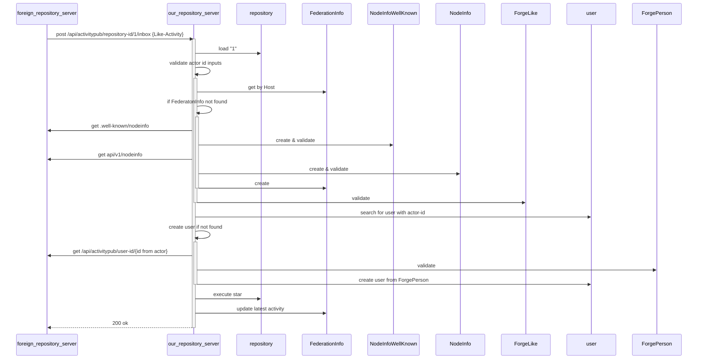
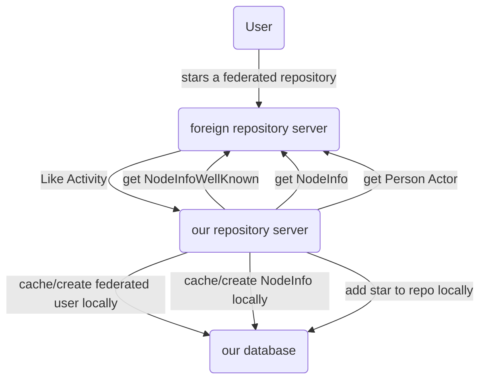

# Threat Analysis for RemoteLogin propagation

See also [1] for getting an idea about the analysis.

## Technical Background
### Control Flow



### Data transferred

```
# NodeInfoWellKnown
{"links":[
  {"href":"https://federated-repo.prod.meissa.de/api/v1/nodeinfo",
  "rel":"http://nodeinfo.diaspora.software/ns/schema/2.1"}]}

# NodeInfo
{"version":"2.1",
 "software":{"name":"gitea",
 ...}}

# LikeActivity
{"id": "https://repo.prod.meissa.de/api/v1/activitypub/user-id/1/outbox/12345",
  "type": "Like",
  "actor": "https://repo.prod.meissa.de/api/v1/activitypub/user-id/1",
  "object": "https://codeberg.org/api/v1/activitypub/repository-id/12"
  "startTime": "2014-12-31T23:00:00-08:00"
}

# Person
{"id":"https://federated-repo.prod.meissa.de/api/v1/activitypub/user-id/10",
 "type":"Person",
 "preferredUsername":"stargoose9",
 "name": "goose going to star the repo",
 "publicKey":{"id":"https://federated-repo.prod.meissa.de/api/v1/activitypub/user-id/10#main-key",
		"owner":"https://federated-repo.prod.meissa.de/api/v1/activitypub/user-id/10",
		"publicKeyPem":"-----BEGIN PUBLIC KEY-----\nMIIBoj...XAgMBAAE=\n-----END PUBLIC KEY-----\n"}}
```

### Data Flow



## Analysis
### Assets

1. **Service Availability**: The availability of our or foreign servers.
2. **Instance Reputation**: We hope our project does not live on a spam instance.
3. **Project Reputation**: The reputation of an individual project.

### Actors

1. **Script Kiddies**: Boored teens, willing to do some illegal stuff without deep knowledge of tech details but broad knowledge across internet discussions. Able to do some bash / python scripting.
2. **Experienced Hacker**: Hacker with deep knowledge.
3. **Hacker**: Hacker with some knowledge.
4. **Malicious Fediverse Member**: Malicious Members of the fediverse, able to operate malicious forge instances.
5. **Malicious Forge Admin**: Admin of good reputation forge instance in the fediverse.
6. **Federated User**: Members of good reputation forge instance in the fediverse.

### Threat

1.

### Mitigations

1. 

### DREAD-Score

| Threat | Damage  | Reproducibility | Exploitability | Affected Users | Discoverability | Mitigations |
| :----- | :------ | :-------------- | :------------- | :------------- | :-------------- | :---------- |
| 1.     | ... tbd |                 |                |                |                 |             |
| 2.     | ... tbd |                 |                |                |                 |             |

Threat Score with values between 1 - 6

* Damage – how severe would the damage be if the attack is successful? 6 is a very bad damage.
* Reproducibility – how easy would the attack be reproducible? 6 is very easy to reproduce.
* Exploitability – How much time, effort and experience are necessary to exploit the threat? 6 is very easy to make.
* Affected Users – if a threat were exploited, how many percentage of users would be affected?
* Discoverability – How easy can an attack be discovered? Does the attacker have to expect prosecution? 6 is very hard to discover / is not illegal

## Contributors


## Reference

[1]: https://owasp.org/www-community/Threat_Modeling_Process