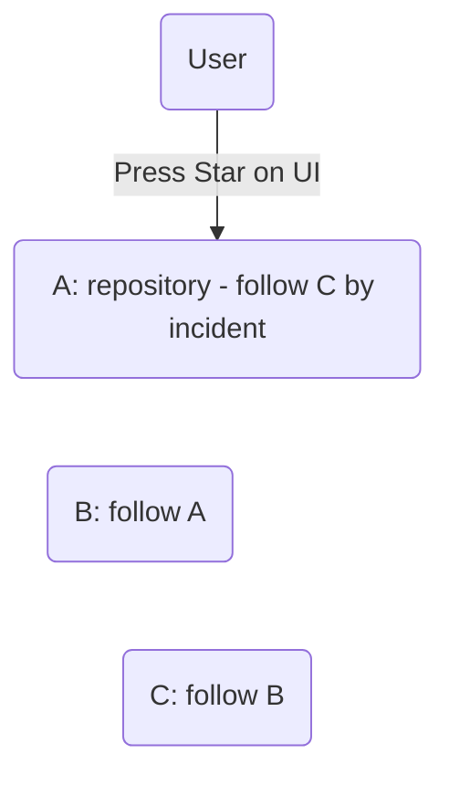
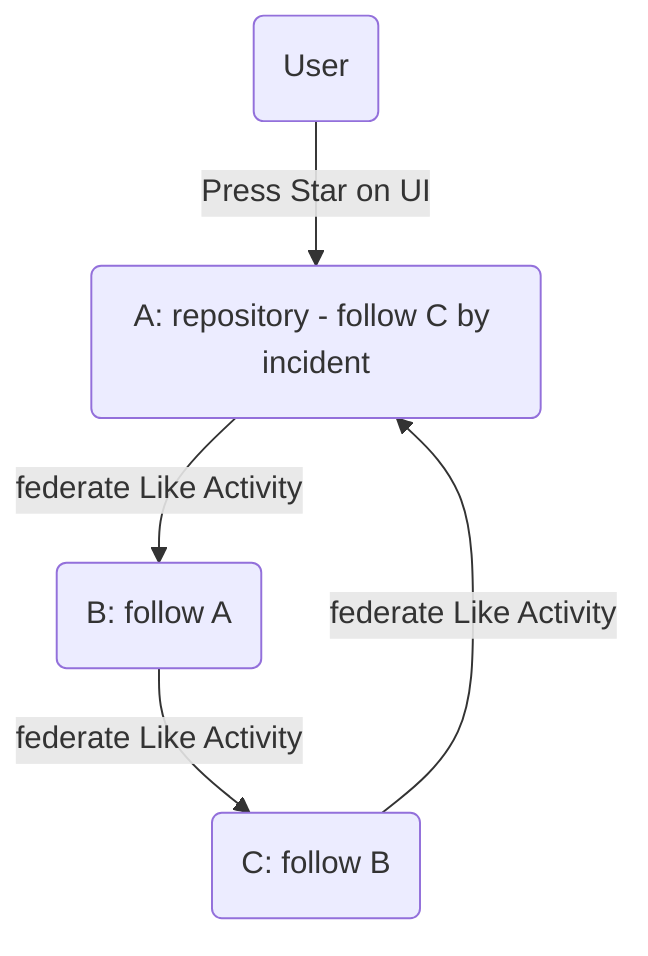
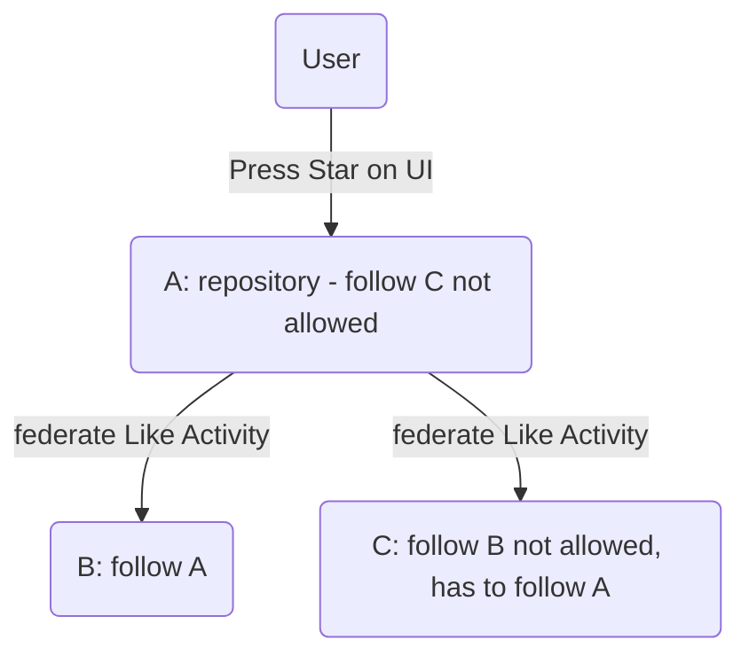

# How to Trigger Activities

- [How to Trigger Activities](#how-to-trigger-activities)
  - [Status](#status)
  - [Context](#context)
  - [Decision](#decision)
  - [Choices](#choices)
    - [1. Transient Federation without Constraints](#1-transient-federation-without-constraints)
      - [Problem - Circularity And Inconsistency](#problem---circularity-and-inconsistency)
    - [2. Direct Federation only](#2-direct-federation-only)
      - [Discussion for option 2.](#discussion-for-option-2)
    - [3. Transient Federation and Remember Processed](#3-transient-federation-and-remember-processed)
  - [See also](#see-also)

## Status

Proposal

## Context

While implementing the trigger of federated stars we have to handle the distribution of corresponding Like-Activities to the federated repositories.

This must be done consistently and without circularity, such that a repository starring by a user leads to exactly one added star in every federated repository.

## Decision

## Choices

### 1. Transient Federation without Constraints

In this case the star federation process would look like:

1. Repo on an instance receives a star (regardless of whether via UI or federation)
2. Instance federates star to all repos that are set as federated repositories.

#### Problem - Circularity And Inconsistency

Circular federation would lead to a infinite circular distribution of Like-Activities:

1. Given a repo on the 3 instances A, B, C.   
   Repo on instance A has set repo on instance B as federation repo.   
   Repo on instance B has set repo on instance C as federation repo.   
   Repo on instance C has set repo on instance A as federation repo.   
2. User stars repo on instance A via UI.
3. Instance A sends Like-Activity to repo on instance B.
4. Instance B creates local FederatedUser, stars the repo and sends Like-Activity to repo on instance C.
5. Instance C creates local FederatedUser, stars the repo and sends Like-Activity to repo on instance A.
6. Instance A creates local FederatedUser, since the Actor of the Like-Activity is the local FederatedUser created on instance C.   
   Thus, the repo on instance A gets another star by this user and sends Like-Activity to the repo on instance C.
7. The circular distribution of Like-Activities continues, since the actor is always the local FederatedUser of the sending instance.

### 2. Direct Federation only

In this case the star federation process would look like:

1. Case: Repo on an instance receives a star by an authenticated user via UI/API:
    1. Repository gets starred by the authenticated User.
    2. Instance federates star to all repos that are set as federated repositories.
2. Case: Repo on an instance receives a star via a Like-Activity:
    1. Instance creates FederatedUser and stars the repository.
    2. No further star federation to federated repos is triggered.

#### Discussion for option 2.

1. pro
   1. Prevent circular communication
   2. Clear semantic also in case of "Who should authorize a digital signature"

### 3. Transient Federation and Remember Processed

In this case the star federation process would look like:

1. Repo on an instance receives a star (regardless of whether via UI or federation)
2. If this activity was not operated already in this instance, federate star to all repos that are set as federated repositories.

## See also

