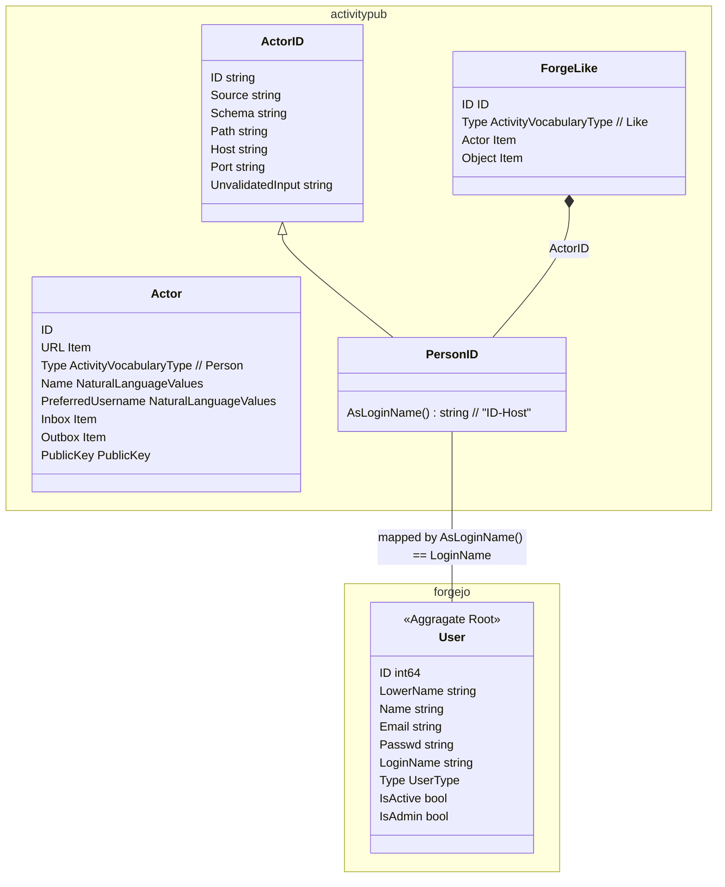
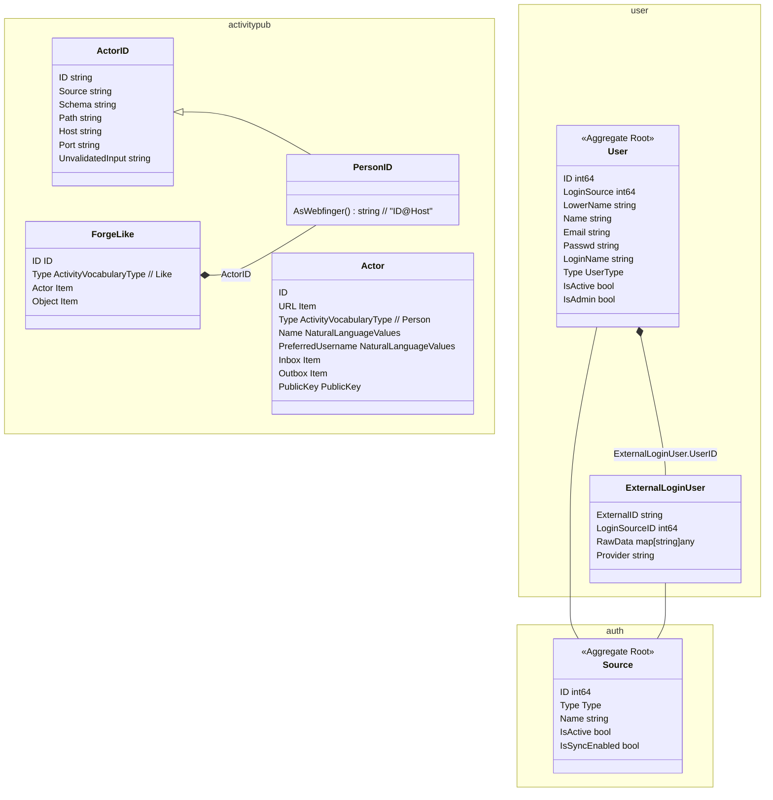
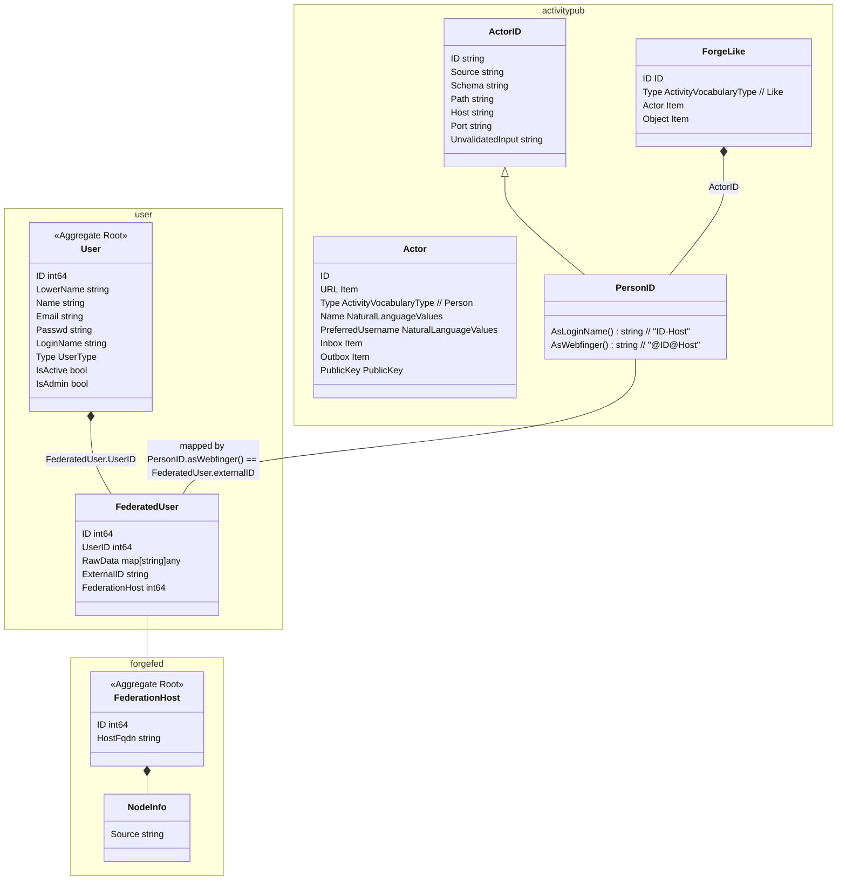
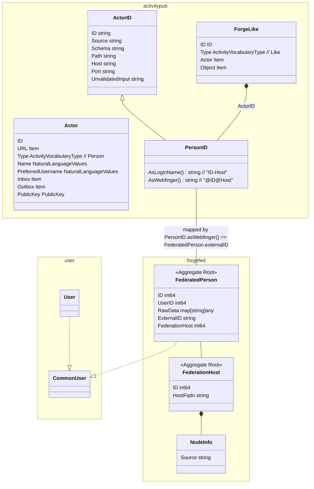

# Activity for federated star action

- [Activity for federated star action](#activity-for-federated-star-action)
  - [Status](#status)
  - [Context](#context)
  - [Decision](#decision)
  - [Choices](#choices)
    - [1. Map to User only](#1-map-to-user-only)
    - [2. Map to User-2-ExternalLoginUser](#2-map-to-user-2-externalloginuser)
    - [3. Map to User-2-FederatedUser](#3-map-to-user-2-federateduser)
    - [3. Map to new FederatedPerson and introduce a common User interface](#3-map-to-new-federatedperson-and-introduce-a-common-user-interface)

## Status

Still in discussion

## Context

While implementing federation we have to represent persons federated to a local instance. A federated person should be able to execute local actions (as it was a local user) without to many code changes. But the federated person should be able to map to the origin person and keep the crypto stuff to ensure action integrity.

## Decision

tbd

## Choices

### 1. Map to User only

Triggering forgejo actions stays as is, no new model & persistence is introduced.

1. We map PersonId AsLoginName() (e.g. 13-some.instan.ce) to User.LoginName.
2. We accept only URIs as Actor Items
3. We can lookup for federated users without fetching the Person every time.
4. Created User is limited:
   1. non functional email is generated, email notification is false.
   2. strong password is generated silently
   3. User.Type is UserTypeRemoteUser
   4. User is not Admin
   5. User is not Active

### 2. Map to User-2-ExternalLoginUser

Would improve the ability to map to the federation source. 
But login Propagation stuff is not going to be used and will maybe be harmful.

1. We map PersonId.AsWebfinger() (e.g. 13@some.instan.ce) to ExternalLoginUser.ExternalID. LoginSourceID may be left Empty.
2. We accept only URIs as Actor Items
3. We can lookup for federated users without fetching the Person every time.
4. Created User is limited:
   1. non functional email is generated, email notification is false.
   2. strong password is generated silently
   3. User.Type is UserTypeRemoteUser
   4. User is not Admin
   5. User is not Active
5. Created ExternalLoginUser is limited
   1. Login via fediverse is not intended and will not work

### 3. Map to User-2-FederatedUser

Would improve the ability to map to the federation source. But we will have a additional model & table for FederatedUser

1. We map PersonId.asWbfinger() to FederatedPerson.ExternalID (e.g. 13@some.instan.ce).
2. We accept only URIs as Actor Items
3. We can lookup for federated users without fetching the Person every time.
4. Created User is limited:
   1. non functional email is generated, email notification is false.
   2. strong password is generated silently
   3. User.Type is UserTypeRemoteUser
   4. User is not Admin
   5. User is not Active
5. Created ExternalLoginUser is limited
   1. Login via fediverse is not intended and will not work

### 3. Map to new FederatedPerson and introduce a common User interface

Cached FederatedPerson is mainly independent to existing User. At every place of interaction we have to enhance persistence & introduce a common User interface.

1. We map PersonId.asWbfinger() to FederatedPerson.ExternalID (e.g. 13@some.instan.ce).
2. We accept only URIs as Actor Items
3. We can lookup for federated persons without fetching the Person every time.

