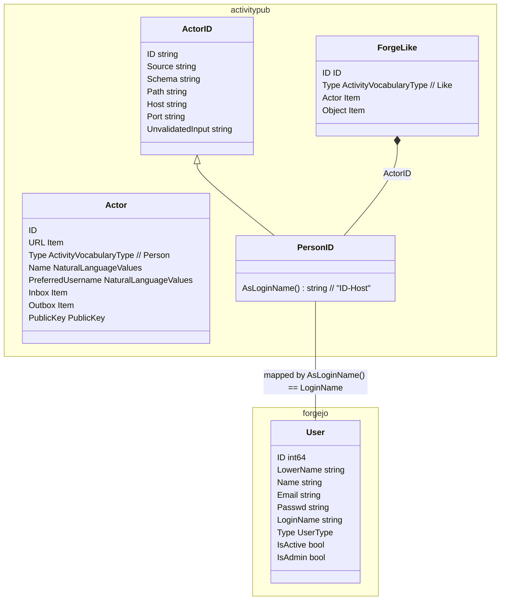
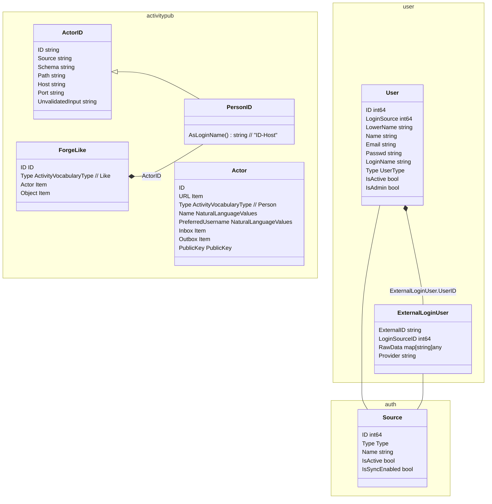
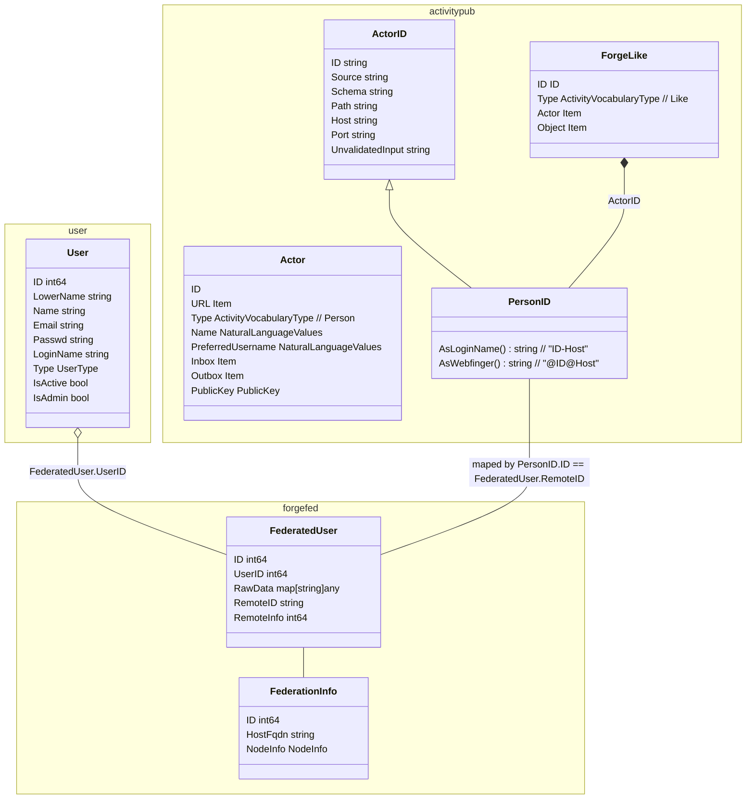

# Activity for federated star action

## Status

Still in discussion

## Context

While implementing federation we have to represent persons federated to a local instance. A federated person should be able to execute local actions (as it was a local user) without to many code changes. But the federated person should be able to map to the origin person and keep the crypto stuff to ensure action integrity.

## Decision

tbd

## Choices

### 1. Map to User.LoginName by AsLoginName()

1. We map PersonId AsLoginName() to User.LoginName.
2. We accept only URIs as Actor Items
3. We can lookup for federated users without fetching the Person every time.
4. Created User is limited:
   1. non functional email is generated, email notification is false.
   2. strong password is generated silently
   3. User.Type is UserTypeRemoteUser
   4. User is not Admin
   5. User is not Active

### 2. Map to ExternalLoginUser

Would improve the ability to map to the federation source.

But login Propagation stuff is not going to be used and will maybe be harmful.

### 3. Map to FederatedUser

Would improve the ability to map to the federation source.

