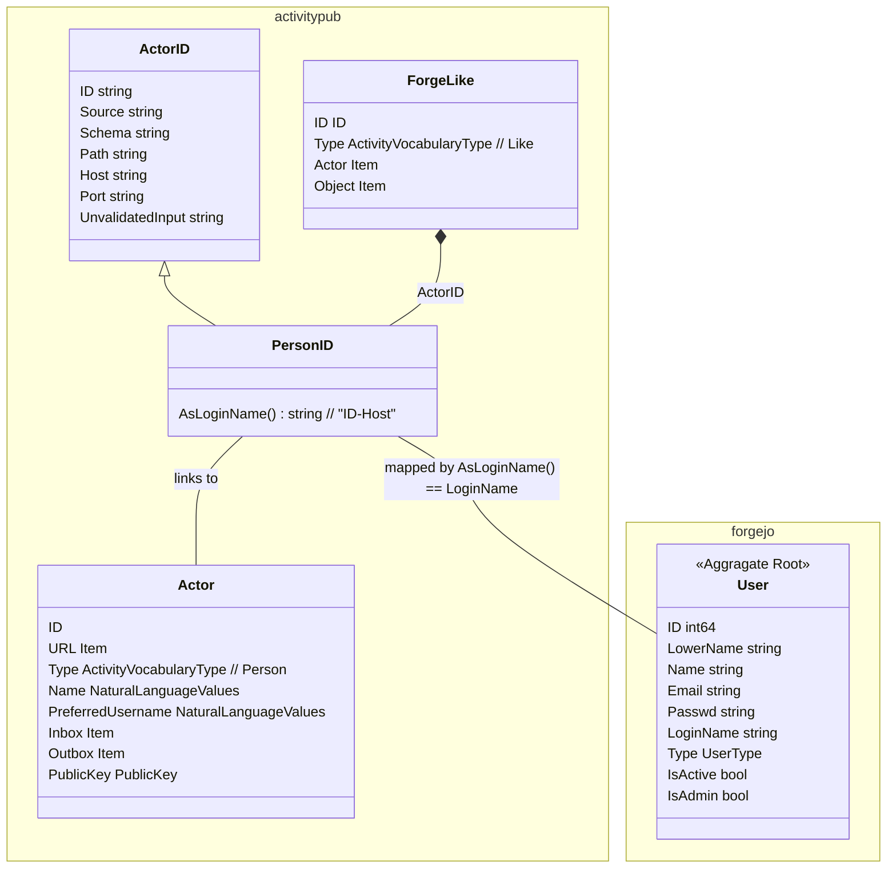
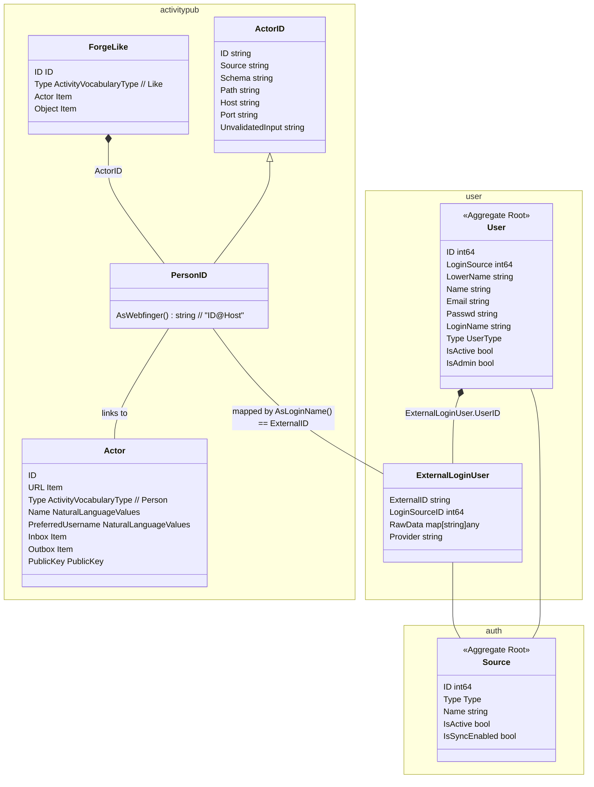
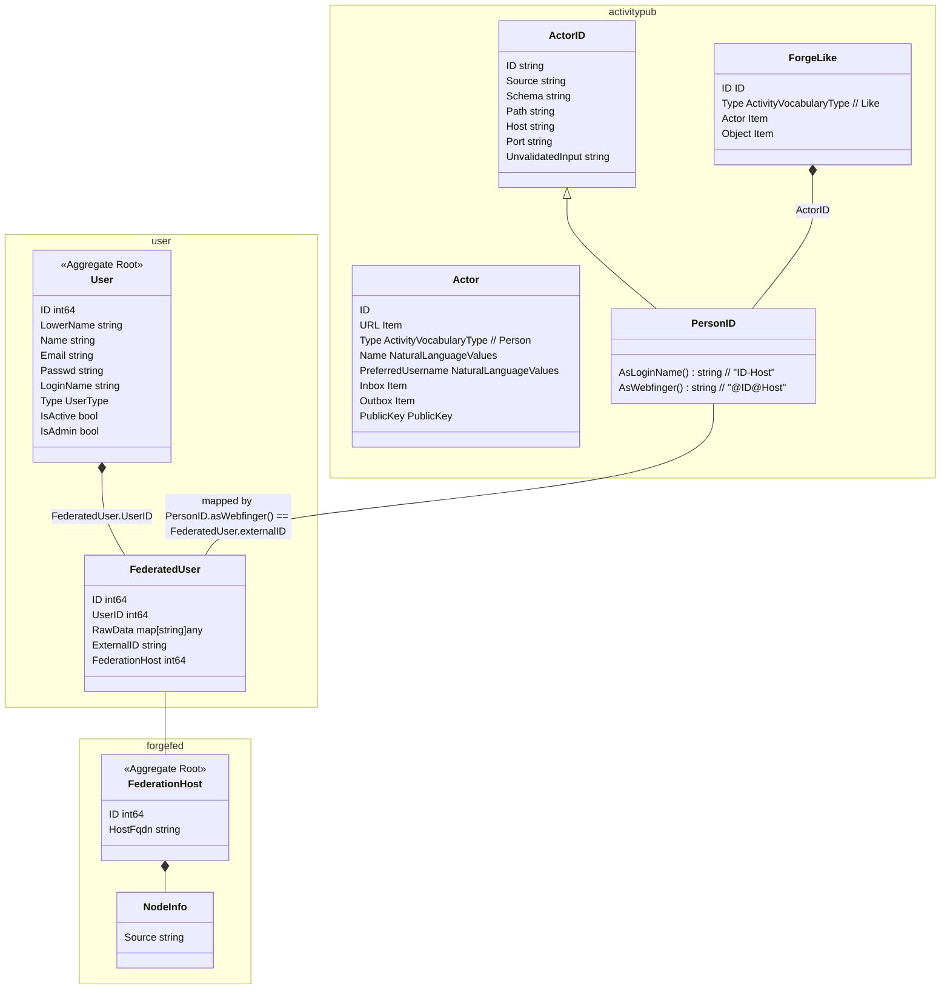
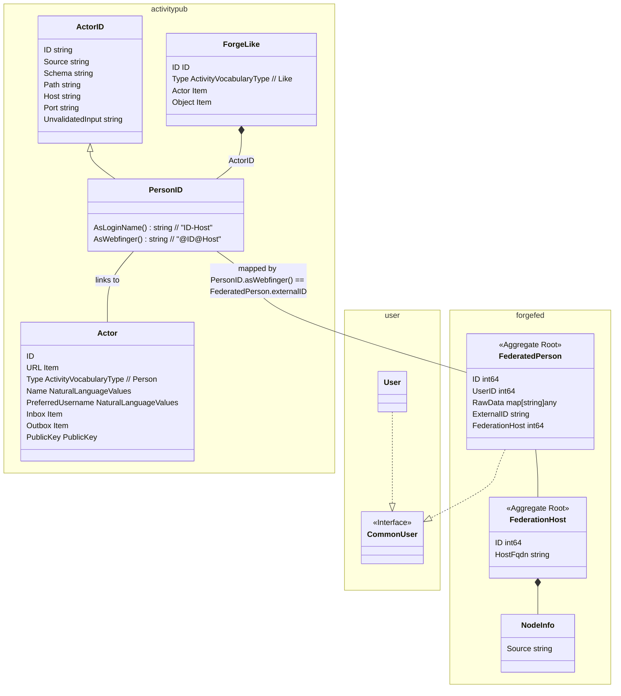

# Activity for federated star action

- [Activity for federated star action](#activity-for-federated-star-action)
  - [Status](#status)
  - [Context](#context)
  - [Decision](#decision)
  - [Choices](#choices)
    - [1. Map to plain forgejo User](#1-map-to-plain-forgejo-user)
    - [2. Map to User-\&-ExternalLoginUser](#2-map-to-user--externalloginuser)
    - [3. Map to User-\&-FederatedUser](#3-map-to-user--federateduser)
    - [4. Map to new FederatedPerson and introduce a common User interface](#4-map-to-new-federatedperson-and-introduce-a-common-user-interface)

## Status

Still in discussion

## Context

While implementing federation we have to represent federated persons on a local instance.

A federated person should be able to execute local actions (as if he was a local user), ideally without too many code changes.

For being able to map the federated person reliable, the local representation has to carry a clear mapping to the original federated person.

We get actor information as `{"actor": "https://repo.prod.meissa.de/api/v1/activitypub/user-id/1",}`. To find out whether this user is available locally without dereference the federated person every time is important for performance & system resilience.

## Decision

tbd

## Choices

### 1. Map to plain forgejo User

1. We map PersonId AsLoginName() (e.g. 13-some.instan.ce) to User.LoginName. Due to limitations of User.LoginName validation mapping may be affected by invalid characters.
2. Created User is limited:
   1. non functional email is generated, email notification is false. At the moment we have problems with email whitelists at this point.
   2. strong password is generated silently
   3. User.Type is UserTypeRemoteUser
   4. User is not Admin
   5. User is not Active

We can use forgejo code (like star / unstar fkt.) without changes.

No new model & persistence is introduced.

But we use fields against their semantic and see some problems / limitations for mapping arise.

### 2. Map to User-&-ExternalLoginUser

1. We map PersonId.AsWebfinger() (e.g. 13@some.instan.ce) to ExternalLoginUser.ExternalID. LoginSourceID may be left Empty.
2. Created User is limited:
   1. non functional email is generated, email notification is false.
   2. strong password is generated silently
   3. User.Type is UserTypeRemoteUser
   4. User is not Admin
   5. User is not Active
3. Created ExternalLoginUser is limited
   1. Login via fediverse is not intended and will not work

We can use forgejo code (like star / unstar fkt.) without changes.

No new model & persistence is introduced, no need for refactorings.

But we use fields against their semantic (User.EMail, User.Password, User.LoginSource, ExternalLoginUser.Login*) and see some problems / limitations for login functionality arise.

Mapping may be more reliable compared to option 1.

### 3. Map to User-&-FederatedUser

1. We map PersonId.asWbfinger() to FederatedPerson.ExternalID (e.g. 13@some.instan.ce).
2. Created User is limited:
   1. non functional email is generated, email notification is false.
   2. strong password is generated silently
   3. User.Type is UserTypeRemoteUser
   4. User is not Admin
   5. User is not Active

We can use forgejo code (like star / unstar fkt.) without changes.

Introduce FederatedUser as new & persistence, no need for refactorings.

But we use fields (User.EMail, User.Password) against their semantic, but we probably can handle the problems arising.

We will be able to have a reliable mapping.

### 4. Map to new FederatedPerson and introduce a common User interface

Cached FederatedPerson is mainly independent to existing User. At every place of interaction we have to enhance persistence & introduce a common User interface.

1. We map PersonId.asWbfinger() to FederatedPerson.ExternalID (e.g. 13@some.instan.ce).
2. We will have no semantic mismatch.

We can use forgejo code (like star / unstar fkt.) after refactorings only.

We introduce new model & persistence.

We will be able to have a reliable mapping.

