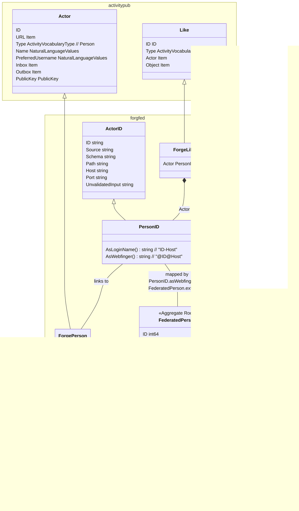

# Activity for federated star action

- [Activity for federated star action](#activity-for-federated-star-action)
  - [Status](#status)
  - [Context](#context)
  - [Decision](#decision)
  - [Choices](#choices)
    - [1. Map to plain forgejo User](#1-map-to-plain-forgejo-user)
      - [1. Pro](#1-pro)
      - [1. Con](#1-con)
    - [2. Map to User-\&-ExternalLoginUser](#2-map-to-user--externalloginuser)
      - [2. Pro](#2-pro)
      - [2. Con](#2-con)
    - [3. Map to User-\&-FederatedUser](#3-map-to-user--federateduser)
      - [3. Pro](#3-pro)
      - [3. Con](#3-con)
    - [4. Map to new FederatedPerson and introduce a common User interface](#4-map-to-new-federatedperson-and-introduce-a-common-user-interface)
      - [4. Pro](#4-pro)
      - [4. Con](#4-con)

## Status

Still in discussion

## Context

While implementing federation we have to represent federated persons on a local instance.

A federated person should be able to execute local actions (as if he was a local user), ideally without too many code changes.

For being able to map the federated person reliable, the local representation has to carry a clear mapping to the original federated person.

We get actor information as `{"actor": "https://repo.prod.meissa.de/api/v1/activitypub/user-id/1",}`. To find out whether this user is available locally without dereference the federated person every time is important for performance & system resilience.

## Decision

tbd

## Choices

### 1. Map to plain forgejo User

1. We map PersonId AsLoginName() (e.g. 13-some.instan.ce) to User.LoginName. Due to limitations of User.LoginName validation mapping may be affected by invalid characters.
2. Created User is limited:
   1. non functional email is generated, email notification is false. At the moment we have problems with email whitelists at this point.
   2. strong password is generated silently
   3. User.Type is UserTypeRemoteUser
   4. User is not Admin
   5. User is not Active

#### 1. Pro

1. We can use forgejo code (like star / unstar fkt.) without changes.
2. No new model & persistence is introduced, architectural change is small.

#### 1. Con

1. But we use fields against their semantic and see some problems / limitations for mapping arise.
   1. generating email having the source fqdn is impacted by email whitelists.
   1. loginName is used for mapping, but e.g. @ is not allowed.
   1. password is generated headless.
2. Maybe the large User table gets even larger (see https://git.exozy.me/a/gitea/issues/2)
3. Occasional contributors may not understand the difference in level of trust implied by federated user. This may promote errors with security impact.
4. Understanding federated users entries being kind of cache would conflict with user table entries.
5. LoginNames may be occupied by federated users. This may leak information and increase attack surface.

### 2. Map to User-&-ExternalLoginUser

1. We map PersonId.AsWebfinger() (e.g. 13@some.instan.ce) to ExternalLoginUser.ExternalID. LoginSourceID may be left Empty.
2. Created User is limited:
   1. non functional email is generated, email notification is false.
   2. strong password is generated silently
   3. User.Type is UserTypeRemoteUser
   4. User is not Admin
   5. User is not Active
3. Created ExternalLoginUser is limited
   1. Login via fediverse is not intended and will not work. This is distinct to the F3 usecase.

#### 2. Pro

1. We can use forgejo code (like star / unstar fkt.) without changes.
2. No new model & persistence is introduced, architectural change is small. Comparable to option 1.
3. This option was taken by the F3-Export/Import-Feature
4. Mapping may be more reliable compared to option 1.

#### 2. Con

1. We use fields against their semantic (User.EMail, User.Password, User.LoginSource, ExternalLoginUser.Login*) and see some problems / limitations for login functionality arise. Situation is worse than option 1.
   1. generating email having the source fqdn is impacted by email whitelists.
   2. password is generated headless.
   3. TODO: How would we map/generate User.LoginName ?
   4. TODO: How would we generate ExternalLoginUser.Login* fields?
2. Getting a larger User table applies to this solution comparable to option 1.
3. Occasional contributors may not understand the difference in level of trust implied by federated user, this may promote errors with security impact.
4. Understanding federated users entries being kind of cache would conflict with user table entries.
5. LoginNames may be occupied by federated users. This may leak information and increase attack surface.

### 3. Map to User-&-FederatedUser

1. We map PersonId.asWbfinger() to FederatedPerson.ExternalID (e.g. 13@some.instan.ce).
2. Created User is limited:
   1. non functional email is generated, email notification is false.
   2. strong password is generated silently
   3. User.Type is UserTypeRemoteUser
   4. User is not Admin
   5. User is not Active

#### 3. Pro

1. We can use forgejo code (like star / unstar fkt.) without changes.
2. Introduce FederatedUser as new model & persistence, architectural change is medium.
3. We will be able to have a reliable mapping. Better than option 1 & 2.

#### 3. Con

1. But we use fields (User.EMail, User.Password) against their semantic, but we probably can handle the problems arising. Situation is comparable to option 1.
   1. generating email having the source fqdn is impacted by email whitelists.
   2. password is generated headless.
   3. TODO: How would we map/generate User.LoginName ?
2. Getting a larger User table applies to this solution comparable to option 1.
3. Occasional contributors may not understand the difference in level of trust implied by federated user, this may promote errors with security impact, comparable to option 1.
4. Getting a larger User table applies to this solution comparable to option 1.
5. Understanding federated users entries being kind of cache would conflict with user table entries.
6. LoginNames may be occupied by federated users. This may leak information and increase attack surface.

### 4. Map to new FederatedPerson and introduce a common User interface

1. We map PersonId.asWbfinger() to FederatedPerson.ExternalID (e.g. 13@some.instan.ce).
2. We will have no semantic mismatch.

#### 4. Pro

1. We will be able to have a reliable mapping.
2. We will not use fields against their semantics.
3. We do not enhance user table with "cache entries". Forgejo stays scalable, no additional DOS surface.
4. Occasional contributors may understand a clear difference between user and federated user.
5. No LoginNames where occupied
6. Caching aspects of federated users (like refresh, evict) may be easier to implement.

#### 4. Con

1. We can use forgejo code (like star / unstar fkt.) after refactorings only.
2. At every place of  interaction we have to enhance persistence (e.g. a find may have to query two tables now) & introduce a common User interface.
3. We introduce new model & persistence.

