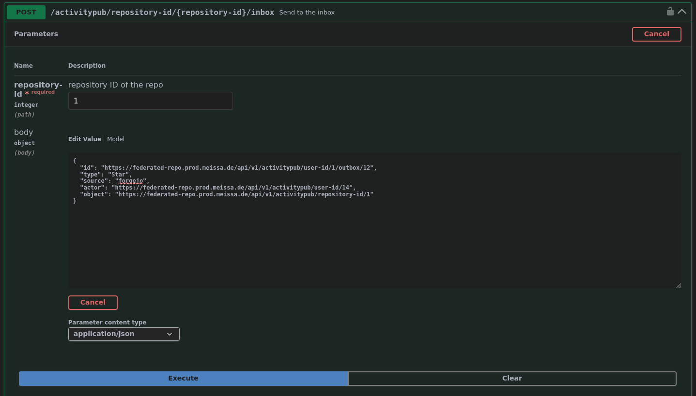
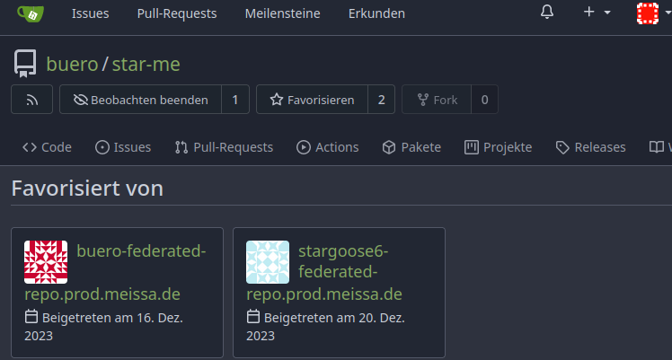

# 2023-11 Activities on "federated star"

We are on the way to implement the feature "federated star / unstar" activity end to end. The goal is to convince the codeberg team to switch this feature on as soon as possible.

At the moment we are implementing the good path. We've reached "create user from response" (see sequence diagram at https://codeberg.org/meissa/forgejo/src/branch/forgejo-federated-star/docs/unsure-where-to-put/threat_analysis_star_activity.md) - so you can expect the first curl-experiment-announcement in near future.

In parallel we start the discussion which new threats might be introduced with this feature. If you are interested in hacking or security, feel welcome to contribute to the threat discussion at: https://codeberg.org/forgejo/forgejo/issues/1854.

# 2023-12 Federated staring open for test

Hey, we ar on our way to implement federated stars. We created a test instance to show the new feature - an now you can test federation live :-)

1. **The repo** ready to receive your star is located at: https://federated-repo.prod.meissa.de/buero/star-me
2. **Post a star activity** at: https://federated-repo.prod.meissa.de/api/swagger#/activitypub/activitypubRepository & press the `Try It Out`` button. The input can look like: 
3. Put "1" in to the repo & add the following payload   
    ``` json
    {
      "id": "https://federated-repo.prod.meissa.de/api/v1/activitypub/user-id/1/outbox/12",
      "type": "Star",
      "source": "forgejo",
      "actor": "https://federated-repo.prod.meissa.de/api/v1/activitypub/user-id/14",
      "object": "https://federated-repo.prod.meissa.de/api/v1/activitypub/repository-id/1"
    }
    ```
4. As every user can only put one star, we created 12 users for your experiment on our instance `"actor": "https://federated-repo.prod.meissa.de/api/v1/activitypub/user-id/2-13",`. But if you are on a forgejo instance having active `activitypub/user-id` api you can insert also your foreign-instance-user-uri here.
5. Press execute & visit again the repo (https://federated-repo.prod.meissa.de/buero/star-me) and enjoy your star :-) 

At the moment we discuss threats arising by this feature. If you are interested we will be happy to get your 2 cents here: https://codeberg.org/forgejo/forgejo/issues/1854

# 2024-01 Federated staring with Like Activity

We did the next step. We now use a plain Like Activity for expressing the Star action.
In addition we fixed some bugs & improved security by validating every input we get on federation.

At https://federated-repo.prod.meissa.de/buero/star-me you can try out the current code the same way as described above with the following activity (maybe find an unused user by alteranting the actors user-id).

``` json
{
  "id": "https://federated-repo.prod.meissa.de/api/v1/activitypub/user-id/1/outbox/12",
  "type": "Like",
  "actor": "https://federated-repo.prod.meissa.de/api/v1/activitypub/user-id/12",
  "object": "https://federated-repo.prod.meissa.de/api/v1/activitypub/repository-id/1",
  "startTime": "2024-01-05T23:00:00-08:00"
}
```

In case of interest find the current roadmap at: https://codeberg.org/forgejo/forgejo/pulls/1680
