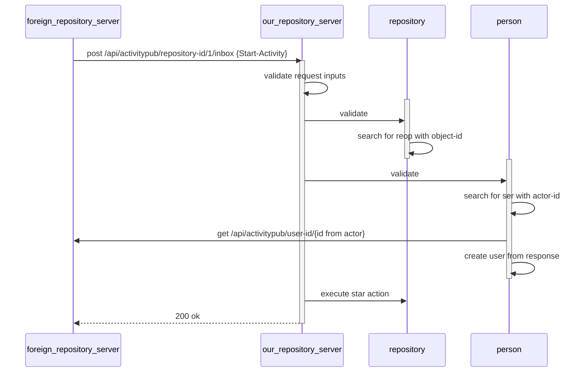

```mermaid
sequenceDiagram
    participant fs as foreign_repository_server
    participant os as our_repository_server

    fs ->> os: post /api/activitypub/repository-id/1/inbox {Start-Activity}
    activate os
    os ->> os: validate request inputs
    activate repository
    os ->> repository: validate
    repository ->> repository: search for reop with object-id
    deactivate repository
    activate person
    os ->> person: validate
    person ->> person: search for ser with actor-id
    person ->> fs: get /api/activitypub/user-id/{id from actor}
    person ->> person: create user from response
    deactivate person
    os ->> repository: execute star action
    os -->> fs: 200 ok
    deactivate os
```