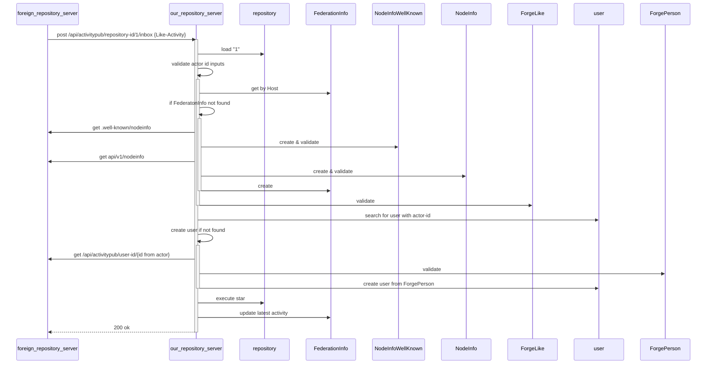
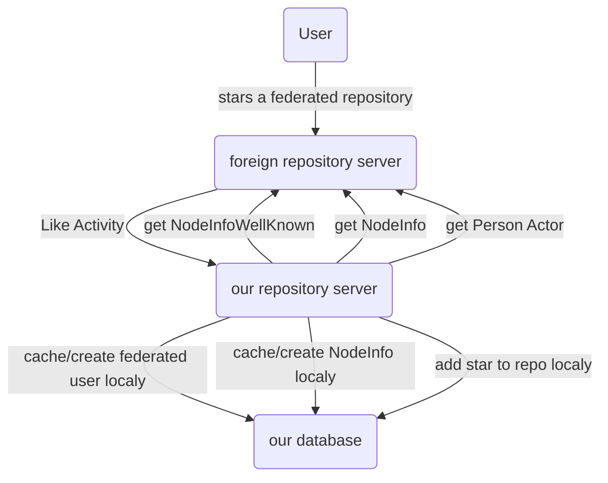

# Threat analysis for the federated Like Activity

See also [1] for getting an idea about the analysis.

## Technical Background
### Control Flow



### Data transfered

```
# NodeInfoWellKnown
{"links":[
  {"href":"https://federated-repo.prod.meissa.de/api/v1/nodeinfo",
  "rel":"http://nodeinfo.diaspora.software/ns/schema/2.1"}]}

# NodeInfo
{"version":"2.1",
 "software":{"name":"gitea",
 ...}}

# LikeActivity
{"id": "https://repo.prod.meissa.de/api/v1/activitypub/user-id/1/outbox/12345",
  "type": "Like",
  "actor": "https://repo.prod.meissa.de/api/v1/activitypub/user-id/1",
  "object": "https://codeberg.org/api/v1/activitypub/repository-id/12"
  "startTime": "2014-12-31T23:00:00-08:00"
}

# Person
{"id":"https://federated-repo.prod.meissa.de/api/v1/activitypub/user-id/10",
 "type":"Person",
 "preferredUsername":"stargoose9",
 "name": "goose going to star the repo",
 "publicKey":{"id":"https://federated-repo.prod.meissa.de/api/v1/activitypub/user-id/10#main-key",
		"owner":"https://federated-repo.prod.meissa.de/api/v1/activitypub/user-id/10",
		"publicKeyPem":"-----BEGIN PUBLIC KEY-----\nMIIBoj...XAgMBAAE=\n-----END PUBLIC KEY-----\n"}}
```

### Data Flow



## Analysis
### Assets

1. **Service Availability**: The availability of our or foreign servers.
2. **Instance Reputation**: We hope our project does not live on a spam instance.
3. **Project Reputation**: The reputation of an individual project.

### Actors

1. **Script Kiddies**: Boored teens, willing to do some illegal stuff without deep knowlege of tech details but broad knowlege across internet discussions. Able to do some bash / python scripting.
2. **Experienced Hacker**: Hacker with deep knowlege.
3. **OpenSource Promoter**: Developers motivated to increase (or decrease) star count for some dedicated projects.

### Threat

1. Script Kiddi sends a Like Activity containing an attack actor url `http://attacked.target/very/special/path` in place of actor. Our repository server sends a `get Person Actor` request to this url. The target receives a DenialdOfService attack. We loose CPU & instance reputation.
2. Experienced hacker sends a Like Activity containing an actor url pointing to an evil forgejo instance. Our repository server sends an `get Person Actor` request to this instance and gets a person having sth. like  `; drop database;` in its name. If our server tries to create a new user out of this persion, the db might be dropped.
3. OpenSource Promoter sends Star Activities containing non authorized Person Actors. The Actors listed as stargazer might get angry about this. The project may loose project reputation.
4. **DOS by Rate**: Experienced Hacker records activities sent and replays some of them. Without order of activities (i.e. timestamp) we can not decide wether we should execute the activity again. If the replayed activities are UnLike Activity we might loose stars.
5. **Reply**: Experienced Hacker records activities sends a massive amount of activities which leads to new user creation & storage loss. Our instance might fall out of service.
6. **Reply out of Order**: Experienced Hacker records activities sends again Unlike Activities happend but was succeded by an Like. Our instance accept the Unlike and removes a star. Our repositore gets rated unintended bad.
7. **DOS by Slowlories**: Experienced Hacker may craft their malicious server to keep connections open. Then they send a Like Activity with the actor URL pointing to that malicious server, and your background job keeps waiting for data. Then they send more such requests, until you exhaust your limit of file descriptors openable for your system and cause a DoS (by causing cascading failures all over the system, given file descriptors are used for about everything, from files, to sockets, to pipes). See also [Slowloris@wikipedia][2].

### Mitigations

1. Validate object uri in order to send only requests to well defined endpoints.
2. giteas global SQL injection protection. TODO: verify if there is one.
3. We accept only signed Activities
4. We accept only activities having an startTime & remember the last executed activity startTime.
5. We introduce (or have) rate limiting per IP.
6. We ensure, that outgoing HTTP requests have a reasonable timeout (if you didn't get that 500b JSON response after 10 seconds, you probably won't get it).

### THREAD-Score

| Threat | Damage  | Reproducibility | Exploitability | Affected Users | Discoverability | Mitigations |
| :----- | :------ | :-------------- | :------------- | :------------- | :-------------- | :---------- |
| 1.     | ... tbd |                 |                |                |                 |             |
| 2.     | ... tbd |                 |                |                |                 |             |

Threat Score with values between 1 - 6

* Damage – how severe would the damage be if the attack is successful? 6 is a very bad damage.
* Reproducibility – how easy would the attack be reproducible? 6 is very easy to reproduce.
* Exploitability – How much time, effort and experience are necessary to exploit the threat? 6 is very easy to make.
* Affected Users – if a threat were exploited, how many percentage of users would be affected?
* Discoverability – How easy can an attack be discovered? Does the attacker have to expect prosecution? 6 is very hard to discover / is not illegal

## Contributors

In adition to direct commiter our special thanks goes to the experts joining our discussions:

* [kik](https://codeberg.org/oelmekki)

## Reference

[1]: https://geballte-sicherheit.de/threat-modelling-bedrohungsanalyse-7-teil-einstufung-von-bedrohungen-ranking-of-threats/
[2]: https://en.wikipedia.org/wiki/Slowloris_(computer_security)