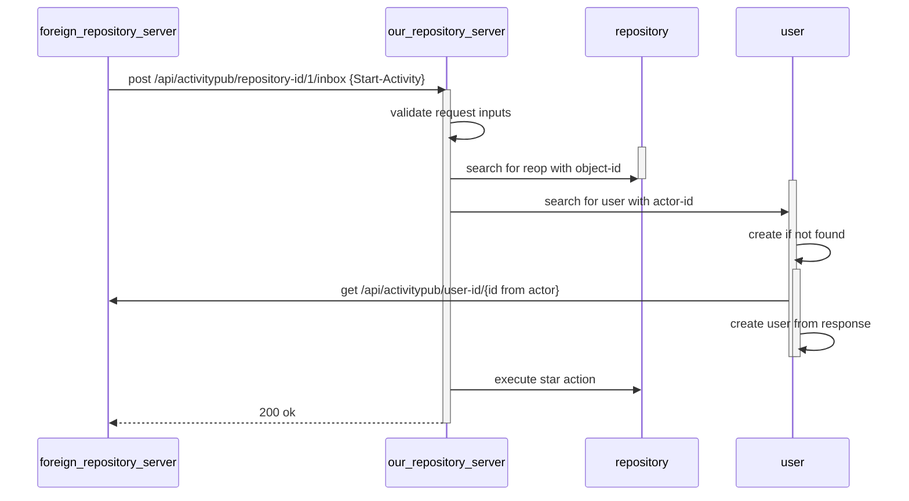
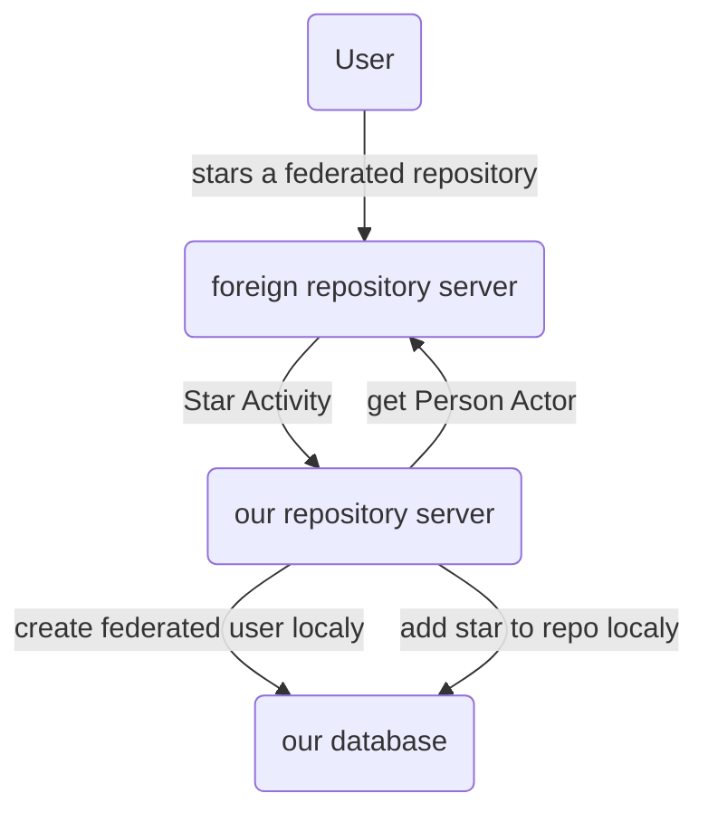

# Threat analysis for the federated star activity

See also [1] for getting an idea about the analysis.

## Technical Background
### Control Flow



### Data transfered

```
# edn notation
{@context [
    "as":    "https://www.w3.org/ns/activitystreams#",
    "forge": "https://forgefed.org/ns#",],
  ::as/id "https://repo.prod.meissa.de/api/v1/activitypub/user-id/1/outbox/12345",
  ::as/type "Star",
  ::forge/source "forgejo",
  ::as/actor "https://repo.prod.meissa.de/api/v1/activitypub/user-id/1",
  ::as/object "https://codeberg.org/api/v1/activitypub/repository-id/12"
}

# json notation
{"id": "https://repo.prod.meissa.de/api/v1/activitypub/user-id/1/outbox/12345",
  "type": "Star",
  "source": "forgejo",
  "actor": "https://repo.prod.meissa.de/api/v1/activitypub/user-id/1",
  "object": "https://codeberg.org/api/v1/activitypub/repository-id/12"
}
```

### Data Flow



## Analysis
### Assets

1. **Service Availability**: The availability of our or foreign servers.
2. **Reputation**: Our standing against freinds and others.

### Actors

1. **Script Kiddies**: Boored teens, willing to do some illegal stuff without deep knowlege of tech details but broad knowlege across internet discussions. Able to do some bash / python scripting.
2. **Experienced Hacker**: Hacker with deep knowlege.
3. **OpenSource Promoter**: Developers motivated to increase (or decrease) star count for some dedicated projects.

### Threat

1. Script Kiddi sends a Star Activity containing an attack actor url `http://attacked.target/very/special/path` in place of actor. Our repository server sends a `get Person Actor` request to this url. The target receives a DenialdOfService attack. We loose CPU & reputation.
2. Experienced hacker sends a Star Activity containing an actor url pointing to an evil forgejo instance. Our repository server sends an `get Person Actor` request to this instance and gets a person having sth. like  `; drop database;` in its name. If our server tries to create a new user out of this persion, the db might be dropped.
3. OpenSource Promoter sends Star Activities containing non authorized Person Actors. The Actors listed as stargazer might get angry about this, we loose reputation.
4. Experienced Hacker records activities sent and replays some of them. Without order of activities (i.e. timestamp) we can not decide wether we should execute the activity again. If the replayed activities are Unstar Activity we might loose stars.
5. Experienced Hacker records activities sends a massive amount of activities which leads to new user creation & storage loss. Our instance might fall out of service.
6. Experienced Hacker may craft their malicious server to keep connections open. Then they send a Star activity with the actor URL pointing to that malicious server, and your background job keeps waiting for data. Then they send more such requests, until you exhaust your limit of file descriptors openable for your system and cause a DoS (by causing cascading failures all over the system, given file descriptors are used for about everything, from files, to sockets, to pipes). See also [Slowloris@wikipedia][2].

### Mitigations

1. Validate object uri in order to send only requests to well defined endpoints.
2. giteas global SQL injection protection. TODO: verify if there is one.
3. We accept only signed Activities
4. We accept only activities having a timestamp & remember the last executed activity timestamp.
5. We introduce (or have) rate limiting per IP.
6. We ensure, that outgoing HTTP requests have a reasonable timeout (if you didn't get that 500b JSON response after 10 seconds, you probably won't get it).

### DREAD-Score

| Threat | Damage  | Reproducibility | Exploitability | Affected Users | Discoverability | Mitigations |
| :----- | :------ | :-------------- | :------------- | :------------- | :-------------- | :---------- |
| 1.     | ... tbd |                 |                |                |                 |             |
| 2.     | ... tbd |                 |                |                |                 |             |

Bewertet wird mit Schulnoten von 1 - 6

* Damage – wie groß wäre der Schaden, wenn der Angriff erfolgreich ist? 6 ist ein sehr schlimmer Schaden.
* Reproducibility – wie einfach wäre der Angriff reproduzierbar? 6 ist sehr einfach zu reproduzieren.
* Exploitability – wieviel Zeit, Aufwand und Erfahrung sind notwendig, um die Bedrohung auszunutzen? 6 ist sehr einfach zu machen.
* Affected Users – wenn eine Bedrohung ausgenutzt werden würde, wieviel Prozent der Benutzer wären betroffen?
* Discoverability – Wie einfach lässt sich ein Angriff entdecken? Muss der Angreifer Strafverfolgung erwarten? 6 ist sehr schwer zu entdecken / ist gar nicht illegal

## Contributors

In adition to direct commiter our special thanks goes to the experts joining our discussions:

* [kik](https://codeberg.org/oelmekki)

## Reference

* [1]: https://geballte-sicherheit.de/threat-modelling-bedrohungsanalyse-7-teil-einstufung-von-bedrohungen-ranking-of-threats/
* [2]: https://en.wikipedia.org/wiki/Slowloris_(computer_security)