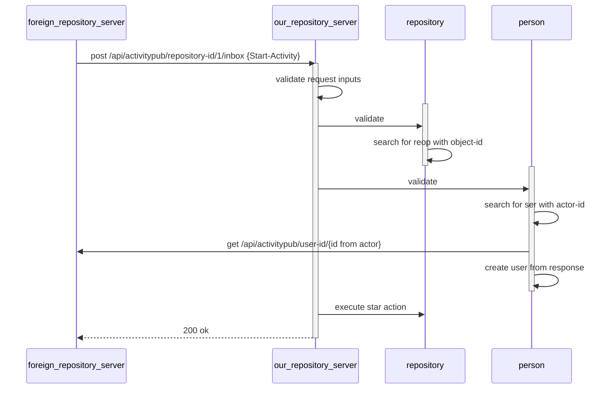
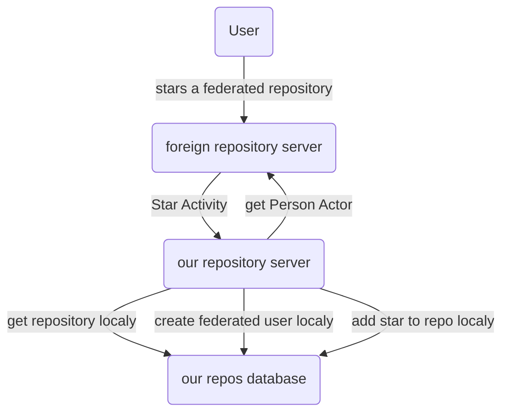

# Threat analysis for the federated star activity

## Technical Background
### Control Flow



### Data transfered

```
# edn notation
{@context [
    "as":    "https://www.w3.org/ns/activitystreams#",
    "forge": "https://forgefed.org/ns#",],
  ::as/id "https://repo.prod.meissa.de/api/v1/activitypub/user-id/1/outbox/12345",
  ::as/type "Star",
  ::forge/source "forgejo",
  ::as/actor "https://repo.prod.meissa.de/api/v1/activitypub/user-id/1",
  ::as/object "https://codeberg.org/api/v1/activitypub/repository-id/12"
}

# json notation
{"id": "https://repo.prod.meissa.de/api/v1/activitypub/user-id/1/outbox/12345",
  "type": "Star",
  "source": "forgejo",
  "actor": "https://repo.prod.meissa.de/api/v1/activitypub/user-id/1",
  "object": "https://codeberg.org/api/v1/activitypub/repository-id/1"
}
```

### Data Flow



## Analysis
### Assets

1. **Service Availability**: The availability of our or foreign servers.
2. **Reputation**: Our standing against freinds and others.

### Actors

1. **Script Kiddies**: Boored teens, willing to do some illigal without deep knowlege of tech details but broad knowlege across internet discussions. Able to do some bash / python scripting.

### Threat

1. Script Kiddi sends a Star Activity containing an attack target url `http://attacked.target/very/special/path` in place of actor. Our repository server sends an `get Person Actor` request to this url. The attacked target gets DenialdOffServices. We loose CPU & reputation.

### DREAD-Score

| Threat | Damage  | Reproducibility | Exploitability | Affected Users | Discoverability | Mitigations |
| :----- | :------ | :-------------- | :------------- | :------------- | :-------------- | :---------- |
| 1.     | ... tbd |                 |                |                |                 |             |
| 2.     | ... tbd |                 |                |                |                 |             |

Bewertet wird mit Schulnoten von 1 - 6

* Damage – wie groß wäre der Schaden, wenn der Angriff erfolgreich ist? 6 ist ein sehr schlimmer Schaden.
* Reproducibility – wie einfach wäre der Angriff reproduzierbar? 6 ist sehr einfach zu reproduzieren.
* Exploitability – wieviel Zeit, Aufwand und Erfahrung sind notwendig, um die Bedrohung auszunutzen? 6 ist sehr einfach zu machen.
* Affected Users – wenn eine Bedrohung ausgenutzt werden würde, wieviel Prozent der Benutzer wären betroffen?
* Discoverability – Wie einfach lässt sich ein Angriff entdecken? Muss der Angreifer Strafverfolgung erwarten? 6 ist sehr schwer zu entdecken / ist gar nicht illegal

## Reference

* https://geballte-sicherheit.de/threat-modelling-bedrohungsanalyse-7-teil-einstufung-von-bedrohungen-ranking-of-threats/